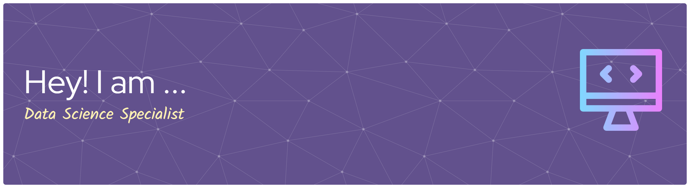

<!--
**Nehlath-he/Nehlath-he** is a ✨ _special_ ✨ repository because its `README.md` (this file) appears on your GitHub profile.

Here are some ideas to get you started:

- 🔭 I’m currently working on ...
- 🌱 I’m currently learning ...
- 👯 I’m looking to collaborate on ...
- 🤔 I’m looking for help with ...
- 💬 Ask me about ...
- 📫 How to reach me: ...
- 😄 Pronouns: ...
- ⚡ Fun fact: ...
-->
# Hi there, I'm [Harmain]! 👋

## About Me 🚀

I'm a passionate **[Data Scientist]** with experience in **[Machine Learning, Deep learning , NLP, Computer Vision, Generative AI and Agentic AI]**. I love tackling complex problems, learning new skills, and collaborating with diverse teams to create innovative solutions.

- 🔭 Working on: **[Machine Learning, Deep learning, Generative and Agentic AI based projects]**
- 🌍 Languages: **[Python, Java, C++, C#]**
- ⚡ Fun fact: **[a fun fact about yourself]**

## My Skills 🧠

